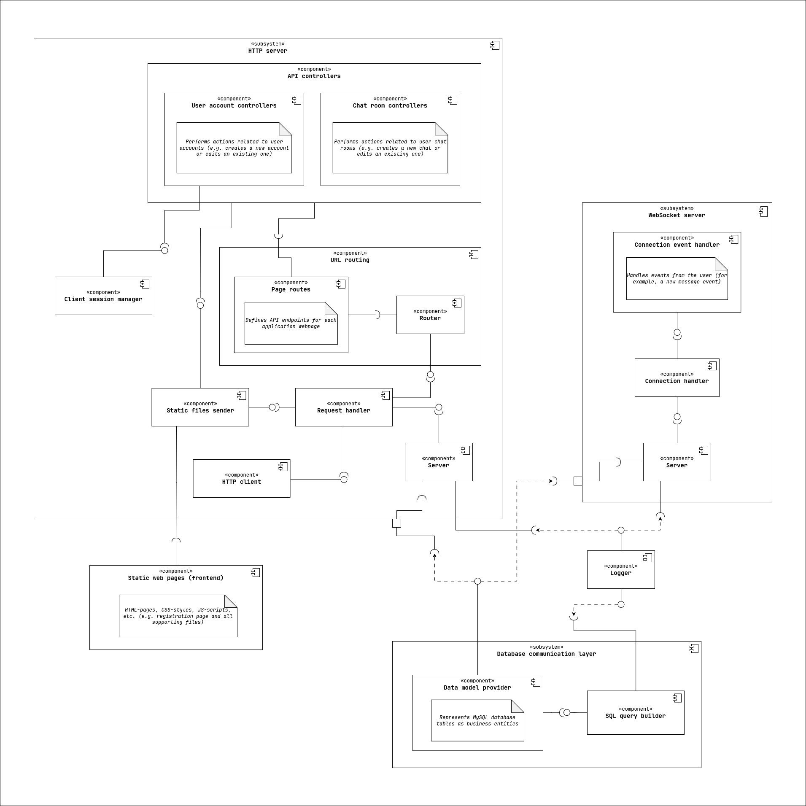
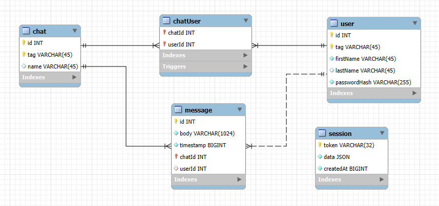
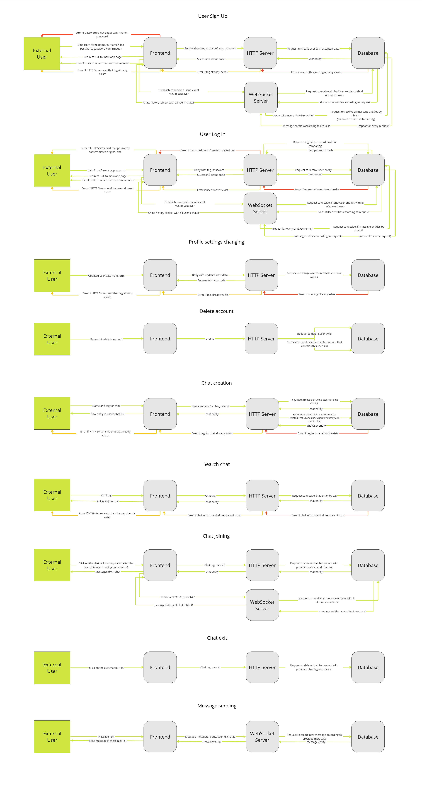

# Лабораторна робота №3

## Діаграма компонентів ПЗ <code>[коміт](https://github.com/OnlyVerySeriousPeople/OpenChat/commit/f0c6b8c2ecdbe8d84edd50ff124c28279a32b36d)</code>

## ER-діаграма <code>[коміт](https://github.com/OnlyVerySeriousPeople/OpenChat/commit/a45f1a2ed77243b3825df96803a06e594006a5b9)</code>

## Оновлення/зміна даних в ключових сценаріях <code>[коміт](https://github.com/OnlyVerySeriousPeople/OpenChat/commit/e9f5c9fe15328cee54e430dc86d1a7fa94265876)</code>

- _Якщо трапляється помилка там де **червоні** стрілки, то помилка одразу відправляється користувачеві (**помаранчеві** стрілки) і всі інші потоки (стрілки) не задіюються_
- _Порядок потоків (стрілок) одного кольору - зверху вниз_

