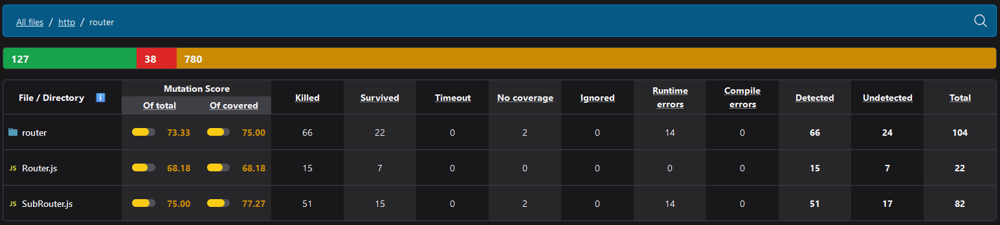
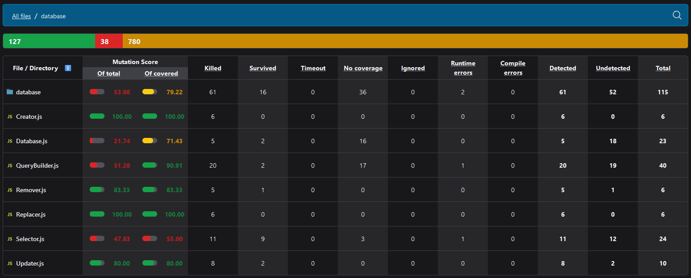

# Лабораторна робота №6

## Юніт-тести <code>[пул-реквест](https://github.com/OnlyVerySeriousPeople/OpenChat/pull/8)</code>

## Інтеграційні тести <code>[пул-реквест](https://github.com/OnlyVerySeriousPeople/OpenChat/pull/9)</code>

## End-to-end тести <code>[пул-реквест](https://github.com/OnlyVerySeriousPeople/OpenChat/pull/10)</code>

## Мутаційні тести <code>[пул-реквест](https://github.com/OnlyVerySeriousPeople/OpenChat/pull/11)</code>

#### **Аналіз поточного тестового покриття**

1. **Юніт-тестування**:
    - Покрито два модулі: база даних і роутер.
    - Результати мутаційного тестування свідчать про такі рівні ефективності:
        - **Router:**
            - Загальний показник для папки — **73.33%** (з покритих тестами — **75.00%**).
            - Найнижчий показник у `Router.js` — **68.18%**, що вказує на зони для оптимізації.
        

        - **Database:**
            - Загальний показник для папки — **53.98%** (з покритих тестами — **79.22%**).
            - Найслабші місця:
                - `Database.js` — **21.74%** (але **71.43%** для покритих тестами).
                - `Selector.js` — **47.83%**, що можна вдосконалити.
        

         Загалом, для юніт-тестів, видно, що покриття не є достатнім в обох модулях, але особливо в модулі бази даних, хоч там і є частини, які покриті доволі добре, такі як, наприклад, Creator та Replacer.

2. **Інтеграційне тестування**:
    - Тести перевіряють взаємодію HTTP і WebSocket серверів із базою даних.
    - Забезпечено перевірку ключових функцій, але глибину перевірок деяких крайніх випадків можна збільшити.

3. **E2E тестування**:
    - Включає основні сценарії взаємодії користувача з програмою (реєстрація, авторизація, створення кімнат, взаємодія з ними, надсилання повідомлень тощо).
    - Покриває реальні сценарії використання, але додавання можливо таких речей як рандомізовані тести могло б допомогти виявити неочевидні проблеми.

Загалом, окрім збільшення кількості сценаріїв тестування, для вдосконалення тестів, було б непогано впровадити метрики покриття коду для всіх етапів тестування, щоб автоматично відстежувати відсоток коду, який покритий тестами. Це дозволить виявляти "сліпі зони" та зосереджувати зусилля на їх усуненні.
Крім того, як було згадано вище запровадження рандомізованого тестування також може покращити розробку, оскільки збільшить вірогідність знаходження багів, якщо вони є.
